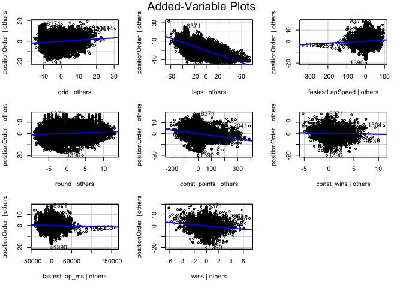

# FORMULA 1 CHAMPIONSHIP EDA AND WINNER PREDICTION

For this project we decided to select a dataset from Kaggle containing
the results of Formula 1 Races from 1950 to today. First we have
performed data merging between all the different dataframes into one
final dataframe (`df`) that contains all the numerical and categorical
features that we found relevant and useful for the initial data
analaysis and the subsequent application of machine learning methods. In
the last part we tried to predict the winner of a Formula 1 race
contained in our dataset using both regression and classification
techniques.

## Loading libraries

``` r
library(ggplot2)
library(dplyr)
library(rpart)
library(corrplot)
library(treemap)
library(treemapify)
library(tree)
library(randomForest)
library(caret)
library(e1071)
library(rpart.plot)
library(car)
```

## Data loading

``` r
df = read.csv("~/Library/Mobile Documents/com~apple~CloudDocs/UNICATT/Data analysis techniques and tools/F1_prediction/datasets/df.csv")
str(df)
```

    ## 'data.frame':    23693 obs. of  25 variables:
    ##  $ raceId          : int  1 1 1 1 1 1 1 1 1 1 ...
    ##  $ driverId        : int  10 15 16 17 18 2 20 21 22 3 ...
    ##  $ constructorId   : int  7 7 10 9 23 2 9 10 23 3 ...
    ##  $ circuitId       : int  1 1 1 1 1 1 1 1 1 1 ...
    ##  $ resultId        : int  7557 7556 7562 7565 7554 7563 7566 7564 7555 7559 ...
    ##  $ number          : int  10 9 20 14 22 6 15 21 23 16 ...
    ##  $ grid            : int  19 20 16 8 1 9 3 15 2 5 ...
    ##  $ positionOrder   : int  4 3 9 12 1 10 13 11 2 6 ...
    ##  $ points          : num  5 6 0 0 10 0 0 0 8 3 ...
    ##  $ laps            : int  58 58 58 57 58 58 56 58 58 58 ...
    ##  $ fastestLapSpeed : num  216 215 215 216 217 ...
    ##  $ status          : chr  "Finished" "Finished" "Finished" "+1 Lap" ...
    ##  $ dob             : chr  "1982-03-18" "1974-07-13" "1983-01-11" "1976-08-27" ...
    ##  $ driv_nationality: chr  "German" "Italian" "German" "Australian" ...
    ##  $ fullname        : chr  "Timo Glock" "Jarno Trulli" "Adrian Sutil" "Mark Webber" ...
    ##  $ round           : int  1 1 1 1 1 1 1 1 1 1 ...
    ##  $ date            : chr  "2009-03-29" "2009-03-29" "2009-03-29" "2009-03-29" ...
    ##  $ const_name      : chr  "Toyota" "Toyota" "Force India" "Red Bull" ...
    ##  $ name            : chr  "Albert Park Grand Prix Circuit" "Albert Park Grand Prix Circuit" "Albert Park Grand Prix Circuit" "Albert Park Grand Prix Circuit" ...
    ##  $ const_points    : num  11 11 0 0 18 0 0 0 18 3 ...
    ##  $ const_wins      : int  0 0 0 0 1 0 0 0 1 0 ...
    ##  $ driver_age      : int  27 35 26 33 29 32 22 36 37 24 ...
    ##  $ fastestLap_ms   : num  88416 88916 88943 88508 88020 ...
    ##  $ winner          : int  0 0 0 0 1 0 0 0 0 0 ...
    ##  $ wins            : int  1 1 1 1 2 1 1 1 1 1 ...

``` r
head(df)
```

    ##   raceId driverId constructorId circuitId resultId number grid positionOrder
    ## 1      1       10             7         1     7557     10   19             4
    ## 2      1       15             7         1     7556      9   20             3
    ## 3      1       16            10         1     7562     20   16             9
    ## 4      1       17             9         1     7565     14    8            12
    ## 5      1       18            23         1     7554     22    1             1
    ## 6      1        2             2         1     7563      6    9            10
    ##   points laps fastestLapSpeed   status        dob driv_nationality
    ## 1      5   58         215.920 Finished 1982-03-18           German
    ## 2      6   58         214.706 Finished 1974-07-13          Italian
    ## 3      0   58         214.640 Finished 1983-01-11           German
    ## 4      0   57         215.695   +1 Lap 1976-08-27       Australian
    ## 5     10   58         216.891 Finished 1980-01-19          British
    ## 6      0   58         216.245 Finished 1977-05-10           German
    ##        fullname round       date  const_name                           name
    ## 1    Timo Glock     1 2009-03-29      Toyota Albert Park Grand Prix Circuit
    ## 2  Jarno Trulli     1 2009-03-29      Toyota Albert Park Grand Prix Circuit
    ## 3  Adrian Sutil     1 2009-03-29 Force India Albert Park Grand Prix Circuit
    ## 4   Mark Webber     1 2009-03-29    Red Bull Albert Park Grand Prix Circuit
    ## 5 Jenson Button     1 2009-03-29       Brawn Albert Park Grand Prix Circuit
    ## 6 Nick Heidfeld     1 2009-03-29  BMW Sauber Albert Park Grand Prix Circuit
    ##   const_points const_wins driver_age fastestLap_ms winner wins
    ## 1           11          0         27         88416      0    1
    ## 2           11          0         35         88916      0    1
    ## 3            0          0         26         88943      0    1
    ## 4            0          0         33         88508      0    1
    ## 5           18          1         29         88020      1    2
    ## 6            0          0         32         88283      0    1

<br>

Our starting dataframe `df` is composed by 25 columns of features that
define for each row a Driver performance in a specific Race of a
specific year. So for each row:

-   5 columns describe the unique observation: `raceId`, `driverId`,
    `constructorId`, `circuitId`, `resultId`. They were useful in the
    initial part of the data processing to merge multiple features from
    other datasets into this one main dataframe that include all the
    features that we later use for data analysis and prediction.

-   2 columns define the perfomance of the driver in the specific race,
    mainly `positionOrder` and the binary `winner`. These are the target
    variables of the regression and classification methods.

-   11 columns are numerical features used:

    -   `number`, number of each driver’s car
    -   `grid`, starting position for the driver
    -   `points`, number of points earned in the race
    -   `laps`, number of laps in the race
    -   `fastestLapSpeed`
    -   `round`, number of the Race in the season
    -   `const_points`, number of points earned by the team before this
        race
    -   `const_wins`, number of wins of the team before the race
    -   `driver_age`, age of each driver
    -   `fastestLap_ms`, fastest lap in the qualification race
    -   `wins`, number of wins before the race for the driver

-   5 columns that describe categorical features:

    -   `status`, what happened in the race for the driver
    -   `driv_nationality`
    -   `fullname`, name of the driver
    -   `const_name`, name of the team
    -   `name`, name of the circuit in which the race takes place

-   2 columns for dates: `dob` is birth date for each driver, `date` is
    the date of the Race.

<br> <br> <br> <br>

# EDA and plots.

``` r
ggplot(df, aes(x=driver_age)) + 
 geom_histogram(aes(y=after_stat(density)), colour="black", fill= '#076fa2')+
 geom_density(alpha=.2, fill="#FF6666") +
 labs(title = 'Histogram of driver age')
```

    ## `stat_bin()` using `bins = 30`. Pick better value with `binwidth`.


The frequency of the drivers’ age from 1950 to 2022 can be traced to a
normal distribution, with a peak around 30 years old. Since the column
driver_age from the data frame collects also the various age during
which the drivers have raced, we can interpret this histogram also like
an indicator of the retirement age of a pilot: we have a peak around 30
years old and then as the age increase its frequency decrease, so we
have less and less pilot with an higher age. <br>

<br>

``` r
df_speed <- read.csv('~/Library/Mobile Documents/com~apple~CloudDocs/UNICATT/Data analysis techniques and tools/F1_prediction/datasets/df_speed.csv')
ggplot(df_speed, aes(x=Circuit, y=Max_Speed)) + 
 geom_bar(colour="black", fill= '#076fa2', stat = 'identity')+
 labs(title = 'Histogram for fastest speed per circuit', x = 'Circuit', y = 'Max Speed') +
 theme(axis.text.x = element_text(angle = 45, vjust = 1, hjust = 1, size = 6))
```


This bar plot shows the fastest lap speed for every circuit (where it
has been registered, since sometimes there isn’t a max speed for a
circuits, especially the oldest). From here we can see where a driver
can dare the most with the accelerator. <br>

``` r
nationality = data.frame(table(df$driv_nationality))
nationality$Var1 = as.character(nationality$Var1)
ggplot(nationality, aes(area = Freq, fill = Freq, label = Var1)) +
  geom_treemap() +
  geom_treemap_text(fontface = "italic", colour = "white", place = "centre", 
                    grow = TRUE) +
  labs(title = "Treemap of the drivers' nationality", fill = "Frequency")
```


<br>

This histogram shows the frequency of every circuit over time.

``` r
ggplot(df, aes(name)) + 
  labs(x = 'Circuits') +
  ggtitle('Circuits Frequency') +
  geom_bar(fill="#076fa2", position = position_dodge(0.7)) +
  theme(axis.text.x = element_text(angle = 45, vjust = 1, hjust = 1, size = 6)) 
```


<br>

Most dangerous circuits

``` r
n_collision <- table(df[df$status == 'Collision', 'name'])
n_collision <- as.data.frame(n_collision)

ggplot(n_collision, aes(area = Freq, fill = Freq, label = Var1)) +
  geom_treemap() +
  geom_treemap_text(fontface = "italic", colour = "white", place = "centre", reflow = TRUE, grow = TRUE) +
  labs(title = "Most dangerous circuits", fill = "Frequency")
```


<br>

Accident ratio per circuit.

``` r
n_accident = read.csv("~/Library/Mobile Documents/com~apple~CloudDocs/UNICATT/Data analysis techniques and tools/F1_prediction/datasets/n_accident.csv")
ggplot(n_accident, aes(x = as.character(Accident.Names), y = Accident.ratio)) + 
  labs(x = 'Circuits') +
  ggtitle('Accident ratios') +
  geom_bar(fill="#076fa2", position = position_dodge(0.7), stat = 'identity') +
  theme(axis.text.x = element_text(angle = 45, vjust = 1, hjust = 1, size = 6)) 
```


<br>

Winning driver age overtime

``` r
df_points = read.csv("~/Library/Mobile Documents/com~apple~CloudDocs/UNICATT/Data analysis techniques and tools/F1_prediction/datasets/df_points.csv")
```

``` r
#define a function to extract age of the championship's winner for every year
winner_Age = function(){
  df_year_winner = matrix(nrow = 1, ncol=5)
  years = seq(1958, 2022, 1)
  for (y in years){
    df_year = df_points[df_points$year == y, c(2,4,9,10)]
    id_winner = df_year[which.max(df_year$points), ]
    df_year_winner <- rbind(df_year_winner, c(y, id_winner$driverId, 
                    id_winner$points, id_winner$fullname, id_winner$driver_age))
  }
  df_year_winner = data.frame(df_year_winner)
  df_year_winner = df_year_winner[-1,]
  return(df_year_winner)
}
df_year_winner = winner_Age()
names(df_year_winner) = c('year', 'driverId', 'final_points', 'fullname', 'age')
df_year_winner$age = as.numeric(df_year_winner$age)
head(df_year_winner)
```

    ##   year driverId final_points      fullname age
    ## 2 1958      578           42 Mike Hawthorn  29
    ## 3 1959      356           31  Jack Brabham  33
    ## 4 1960      356           43  Jack Brabham  34
    ## 5 1961      403           34     Phil Hill  34
    ## 6 1962      289           42   Graham Hill  33
    ## 7 1963      373           54     Jim Clark  27

``` r
#plot for winner's age over time
ggplot(df_year_winner, aes(x = year, y = age)) + 
  labs(x = 'Years', y = 'Age') +
  ggtitle('Winning driver age for every year') +
  geom_bar(stat = "identity") + 
  geom_col(fill = "#076fa2") +
  theme(axis.text.x = element_text(angle = 90, vjust=0.5, hjust = 1)) +
  geom_abline(slope = 0, intercept = mean(df_year_winner$age), 
              color = 'red', linewidth = 1.5)  
```


<br>

How important is the pole position in each circuit to win the race? Each
column is the ratio between how many times a driver have won a race
after he has qualified first.

``` r
pole_ratio = read.csv("~/Library/Mobile Documents/com~apple~CloudDocs/UNICATT/Data analysis techniques and tools/F1_prediction/datasets/pole_ratio.csv")
```

``` r
ggplot(pole_ratio, aes(x = X1, y = X2)) + 
  labs(x = 'Circuit', y = 'Ratio') +
  ggtitle('How important is the pole position') +
  geom_bar(stat = "identity") + 
  geom_col(fill = "#076fa2") +
  theme(axis.text.x = element_text(angle = 45, hjust = 1))
```


<br>

Correlation MATRIX to look for relationships between numerical features.

``` r
corr_matrix = cor(df[c(7,8,9,10,11,16,20,21,22,23,25)])
corrplot(corr_matrix)
```


<br> <br>

# DEFINING AND TRAINING ML MODELS FOR PREDICTION.

``` r
df$winner = as.factor(df$winner) #converting the column to a factor. 
```

<br>

### Partition the data for train and validation.

For partitioning the data, we decided to use a different approach.
Instead of just randomly select rows from the original dataset (we
recall that each row is a driver’s performance in a specific race) we
decided to create a block of rows for each race (with each block
containing multiple observation, i.e. all the drivers that attained the
race) and randomly select 80% blocks for the training sample and the
rest for the testing sample. <br>

We decided to partition the data in this way in order to maintain the
integrity of observations for each race. Otherwise, we could have
situations in which in the testing sets there is just one driver for a
Race, and so his performance would be assessed in the lack of opponents.

``` r
races_list = unique(df$raceId)
races_train_idx = sample(length(races_list), length(races_list)*0.8)

races_train_list = races_list[races_train_idx]
races_test_list = races_list[-races_train_idx]

#creating train & test dataframes
df.train = df[df$raceId %in% races_train_list, ]
df.test = df[df$raceId %in% races_test_list, ]
```

<br>

Fixing `df.train` and `df.test` for categorical features by converting
those columns in factors.

``` r
df.train$status = as.factor(df.train$status)
df.train$driv_nationality = as.factor(df.train$driv_nationality)
df.train$fullname = as.factor(df.train$fullname)
df.train$const_name = as.factor(df.train$const_name)
df.train$name = as.factor(df.train$name)
str(df.train)
```

    ## 'data.frame':    18887 obs. of  25 variables:
    ##  $ raceId          : int  10 10 10 10 10 10 10 10 10 10 ...
    ##  $ driverId        : int  1 10 12 13 15 153 16 17 18 2 ...
    ##  $ constructorId   : int  1 7 4 6 7 5 10 9 23 2 ...
    ##  $ circuitId       : int  11 11 11 11 11 11 11 11 11 11 ...
    ##  $ resultId        : int  7734 7739 7745 7753 7741 7748 7752 7736 7740 7744 ...
    ##  $ number          : int  1 10 8 3 9 11 20 14 22 6 ...
    ##  $ grid            : int  4 13 14 0 11 19 17 3 8 15 ...
    ##  $ positionOrder   : int  1 6 12 20 8 15 19 3 7 11 ...
    ##  $ points          : num  10 3 0 0 1 0 0 6 2 0 ...
    ##  $ laps            : int  70 70 70 0 70 69 1 70 70 70 ...
    ##  $ fastestLapSpeed : num  191 191 189 0 189 ...
    ##  $ status          : Factor w/ 127 levels "+1 Lap","+10 Laps",..: 65 65 65 127 65 1 95 65 65 65 ...
    ##  $ dob             : chr  "1985-01-07" "1982-03-18" "1985-07-25" "1981-04-25" ...
    ##  $ driv_nationality: Factor w/ 41 levels "American","American-Italian",..: 9 19 8 8 24 36 19 5 9 19 ...
    ##  $ fullname        : Factor w/ 574 levels "Adrián Campos",..: 332 535 396 155 259 255 2 355 271 399 ...
    ##  $ round           : int  10 10 10 10 10 10 10 10 10 10 ...
    ##  $ date            : chr  "2009-07-26" "2009-07-26" "2009-07-26" "2009-07-26" ...
    ##  $ const_name      : Factor w/ 156 levels "AGS","Alfa Romeo",..: 101 149 125 52 149 148 56 124 21 13 ...
    ##  $ name            : Factor w/ 70 levels "Adelaide Street Circuit",..: 36 36 36 36 36 36 36 36 36 36 ...
    ##  $ const_points    : num  28 38.5 13 40 38.5 5 0 98.5 114 8 ...
    ##  $ const_wins      : int  1 0 0 0 0 0 0 3 6 0 ...
    ##  $ driver_age      : int  24 27 24 28 35 19 26 33 29 32 ...
    ##  $ fastestLap_ms   : num  82479 82506 83418 0 83261 ...
    ##  $ winner          : Factor w/ 2 levels "0","1": 2 1 1 1 1 1 1 1 1 1 ...
    ##  $ wins            : int  2 1 1 1 1 1 1 2 7 1 ...

``` r
df.test$status = as.factor(df.test$status)
df.test$driv_nationality = as.factor(df.test$driv_nationality)
df.test$fullname = as.factor(df.test$fullname)
df.test$const_name = as.factor(df.test$const_name)
df.test$name = as.factor(df.test$name)
str(df.test)
```

    ## 'data.frame':    4806 obs. of  25 variables:
    ##  $ raceId          : int  1 1 1 1 1 1 1 1 1 1 ...
    ##  $ driverId        : int  10 15 16 17 18 2 20 21 22 3 ...
    ##  $ constructorId   : int  7 7 10 9 23 2 9 10 23 3 ...
    ##  $ circuitId       : int  1 1 1 1 1 1 1 1 1 1 ...
    ##  $ resultId        : int  7557 7556 7562 7565 7554 7563 7566 7564 7555 7559 ...
    ##  $ number          : int  10 9 20 14 22 6 15 21 23 16 ...
    ##  $ grid            : int  19 20 16 8 1 9 3 15 2 5 ...
    ##  $ positionOrder   : int  4 3 9 12 1 10 13 11 2 6 ...
    ##  $ points          : num  5 6 0 0 10 0 0 0 8 3 ...
    ##  $ laps            : int  58 58 58 57 58 58 56 58 58 58 ...
    ##  $ fastestLapSpeed : num  216 215 215 216 217 ...
    ##  $ status          : Factor w/ 88 levels "+1 Lap","+10 Laps",..: 40 40 40 1 40 40 23 40 40 40 ...
    ##  $ dob             : chr  "1982-03-18" "1974-07-13" "1983-01-11" "1976-08-27" ...
    ##  $ driv_nationality: Factor w/ 37 levels "American","Argentine",..: 17 21 17 3 7 17 17 21 6 17 ...
    ##  $ fullname        : Factor w/ 452 levels "Adrián Campos",..: 422 194 2 274 203 309 396 139 389 311 ...
    ##  $ round           : int  1 1 1 1 1 1 1 1 1 1 ...
    ##  $ date            : chr  "2009-03-29" "2009-03-29" "2009-03-29" "2009-03-29" ...
    ##  $ const_name      : Factor w/ 126 levels "AGS","Alfa Romeo",..: 120 120 46 99 21 13 99 46 21 124 ...
    ##  $ name            : Factor w/ 53 levels "Adelaide Street Circuit",..: 3 3 3 3 3 3 3 3 3 3 ...
    ##  $ const_points    : num  11 11 0 0 18 0 0 0 18 3 ...
    ##  $ const_wins      : int  0 0 0 0 1 0 0 0 1 0 ...
    ##  $ driver_age      : int  27 35 26 33 29 32 22 36 37 24 ...
    ##  $ fastestLap_ms   : num  88416 88916 88943 88508 88020 ...
    ##  $ winner          : Factor w/ 2 levels "0","1": 1 1 1 1 2 1 1 1 1 1 ...
    ##  $ wins            : int  1 1 1 1 2 1 1 1 1 1 ...

Fixing FACTOR LEVELS in the testing dataframe. <br>

When partitioning the data, categories for nominal features are shuffled
between `df.train` and `df.test`. This lead to a situation in which
categories in `df.test` could not be present in `df.train` and so
classification models trained on `df.test` would not consider other
categories that are only present in `df.test`. <br>

With the following lines of code we overcome this problem by setting
factor levels of all categorical columns of `df.test` to be exactly the
same as `df.train`. Otherwise, we would encounter problems in the
classifications method when predicting the new data from `df.test` using
the model trained on `df.train`.

``` r
levels(df.test$status) <- levels(df.train$status)
levels(df.test$driv_nationality) <- levels(df.train$driv_nationality)
levels(df.test$fullname) <- levels(df.train$fullname)
levels(df.test$const_name) <- levels(df.train$const_name)
levels(df.test$name) <- levels(df.train$name)
```

<br> <br>

### SCORING FUNCTIONS

The two scoring functions we created, simply calculate the accuracy for
the prediction of the winner of each race.

For the regressions, the scoring functions sort the prediction of
`positionOrder` for each race (by using `raceId`) and take the smallest
value for the prediction (since in the `positionsOrder` the winner has
position 1, hence the smallest position). If the same driver (a row of
df.test) has the real value of `positionOrder` equal to 1, then the
prediction is correct and the score is increased by 1. After scrolling
through all races that are contained in df.test, the `accuracy_score` is
defined as the ratio between score and the number of races.

For the classification, the scoring function works similarly but there
is a difference. We are using the classifications models to predict
`winner` defined in {0,1} but the models in action are going to assign 1
to multiple drivers in the same race (but we can have just one winner in
a race). So instead we look for the greatest probability among the
driver of a race to have the winner feature equal to 1. The driver with
the greatest probability of having the `winner` feature equal to 1 would
be the driver with the greatest probability of winning the race and
hence he is the winner our function pick. The definition of score works
in the same way as in the scoring function for regressions.

<br>

Defining scoring function for Regression.

``` r
score_regression <- function(test, prediction){
  
  df.score.regres = data.frame(test, prediction)
  colnames(df.score.regres)[c(26)] = c('prediction') 
  
  racelist = unique(df.score.regres$raceId)
  
  score = 0
  for (i in 1:length(racelist)){
    race = df.score.regres[df.score.regres$raceId %in% racelist[i], ]
    pred_winner_idx = which.min(race$prediction)
    if (race$positionOrder[pred_winner_idx] == 1){
      score = score + 1
    }
  }
  
  score_ratio = score/length(racelist)
  return(score_ratio)
} 
```

Defining scoring function for Classification.

``` r
score_classification <- function(test, prediction){
  
  df.score.class = data.frame(test, prediction)
  colnames(df.score.class)[c(26,27)] = c('pred_0', 'pred_1')  
  
  racelist = unique(df.score.class$raceId)
  
  score = 0
  for (i in 1:length(racelist)){
    race = df.score.class[df.score.class$raceId %in% racelist[i], ]
    pred_winner_idx = which.max(race$pred_1)
    if (race$positionOrder[pred_winner_idx] == 1){
      score = score + 1
    }
  }
  
  score_ratio = score/length(racelist)
  return(score_ratio)
}
```

<br>

### REGRESSION

#### Training and testing linear regression models.

For the regression model we decided to use as explanatory variables most
of the numerical features as: grid, laps, fastestLapSpeed, round,
const_points, const_wins, fastestLap_ms and wins that presumably would
help predict and explain the final position of the driver. Some
variables were excluced as points, since its high correlation with the
final position (higher number of points means a higher position, were 1
is the highest position).

``` r
linearmodel = lm(positionOrder ~ grid + laps + fastestLapSpeed + round + 
                   const_points + const_wins + fastestLap_ms + wins, data = df.train)
summary(linearmodel)
```

    ## 
    ## Call:
    ## lm(formula = positionOrder ~ grid + laps + fastestLapSpeed + 
    ##     round + const_points + const_wins + fastestLap_ms + wins, 
    ##     data = df.train)
    ## 
    ## Residuals:
    ##      Min       1Q   Median       3Q      Max 
    ## -20.0469  -2.9776  -0.0566   2.9487  20.4586 
    ## 
    ## Coefficients:
    ##                   Estimate Std. Error  t value Pr(>|t|)    
    ## (Intercept)      2.129e+01  1.132e-01  188.108  < 2e-16 ***
    ## grid             1.162e-01  5.191e-03   22.379  < 2e-16 ***
    ## laps            -2.199e-01  1.385e-03 -158.813  < 2e-16 ***
    ## fastestLapSpeed  7.545e-03  1.563e-03    4.828 1.39e-06 ***
    ## round            1.243e-01  7.414e-03   16.764  < 2e-16 ***
    ## const_points    -1.471e-02  6.925e-04  -21.247  < 2e-16 ***
    ## const_wins      -1.503e-01  3.400e-02   -4.420 9.95e-06 ***
    ## fastestLap_ms   -6.332e-06  3.433e-06   -1.844   0.0652 .  
    ## wins            -4.552e-01  4.830e-02   -9.425  < 2e-16 ***
    ## ---
    ## Signif. codes:  0 '***' 0.001 '**' 0.01 '*' 0.05 '.' 0.1 ' ' 1
    ## 
    ## Residual standard error: 4.615 on 18878 degrees of freedom
    ## Multiple R-squared:  0.6365, Adjusted R-squared:  0.6363 
    ## F-statistic:  4131 on 8 and 18878 DF,  p-value: < 2.2e-16

``` r
avPlots(linearmodel)
```



As we can see the linear model obtain an R-squared of 65% that confirms
a good capacity of the model to represent variability in the original
data. Also, the majority of variables are strongly significant.


    ##  682 1390 
    ##  507 1095

In order to test the significance of the whole model, we should first
look at the normality of the residuals. From the qqplot presented above,
it’s clear how the residuals follow aproximately a normal distribution
(they lie on a straight line as normal residuals should). Looking at the
F-test value of the model, it’s clear how the really low value suggests
a strong significance of the whole regression. Hence we can say the
model does a better job in describing the dataset than just the mean.

We can now try to run a prediction and recall `score_regression`
function to see the results of the prediction.

``` r
predict_lm = predict(linearmodel, df.test)
score_regression(df.test, predict_lm) 
```

    ## [1] 0.6896552

<br>

#### Regression tree

Decision trees are another technique that we have used both in
regression and in classification. The model used in regression take as
explanatory the same variables in the regression:

``` r
regr_tree = tree(positionOrder ~ grid + number + laps + fastestLapSpeed 
                          + round + const_points + const_wins + driver_age 
                          + fastestLap_ms + wins, df.train)
predict_rt = predict(regr_tree, newdata = df.test)
score_regression(df.test, predict_rt) 
```

    ## [1] 0.4679803

<br> <br>

### CLASSIFICATION

Using the features class `winner` that we have created, we want to
predict the probability of class=1 (winner) or class=0 (not winner).
Then we are going to sort the probabilities and pick the greater
probability of class=1, hence the driver with the greatest probability
of being a winner. <br>

For the classification methods, we decided to remove those categorical
features as `status`, `fullname` and `const_name` that when converted in
factors where causing problems in the application of the techniques, or
drastically reduced performances due to their dimension (all of those 3
factors presented more than 100 levels that were not accepted by the
functions or ruined the prediction accuracy).

#### BAYES CLASSIFIER

``` r
df.nb <- naiveBayes(winner ~ . -number -positionOrder -resultId -points -status 
                    -fullname -const_name, data = df.train)
prediction_nb <- predict(df.nb, newdata = df.test, type = 'raw')
score_classification(df.test, prediction_nb) 
```

    ## [1] 0.5517241

<br>

#### DECISION TREES

``` r
df.dt = rpart(winner ~ . -number -positionOrder -resultId -points -status 
              -fullname -const_name -dob -date, data = df.train, method="class")
prediction_dt = predict(df.dt, newdata = df.test, method="prob")
score_classification(df.test, prediction_dt) 
```

    ## [1] 0.6157635

``` r
rpart.plot(df.dt,faclen = 2)
```


One of the most attractive properties of decision trees is that they can
be graphically displayed. And as we can see from the tree graph, the two
most important indicators of a winner appear to be `wins` and `grid`, so
the number of wins of the driver before the race and the starting
position in the race obtained during the qualifications. This is also
confirmed by the variable importance section of the rpart object.

``` r
df.dt$variable.importance
```

    ##             wins       const_wins             grid             laps 
    ##      389.3643915      163.7201010      149.6169496       68.1576007 
    ##     const_points             name            round         driverId 
    ##       58.8455246       57.8648512       50.6597080       29.0681425 
    ## driv_nationality        circuitId           raceId  fastestLapSpeed 
    ##        9.4406771        7.7352196        7.5407942        3.6437450 
    ##    fastestLap_ms       driver_age    constructorId 
    ##        2.6035345        0.5297386        0.3405462

Also, we may want to validate the tree by looking at the complexity
parameters through cross validation.

``` r
printcp(df.dt)
```

    ## 
    ## Classification tree:
    ## rpart(formula = winner ~ . - number - positionOrder - resultId - 
    ##     points - status - fullname - const_name - dob - date, data = df.train, 
    ##     method = "class")
    ## 
    ## Variables actually used in tree construction:
    ## [1] grid   laps   name   raceId round  wins  
    ## 
    ## Root node error: 809/18887 = 0.042834
    ## 
    ## n= 18887 
    ## 
    ##         CP nsplit rel error  xerror     xstd
    ## 1 0.028842      0   1.00000 1.00000 0.034397
    ## 2 0.014833      6   0.76267 0.88381 0.032421
    ## 3 0.012979      7   0.74784 0.89370 0.032595
    ## 4 0.010000      9   0.72188 0.88133 0.032377

And select the number of splits with the lowest error.

``` r
pruned.df.dt = prune(df.dt, cp=df.dt$cptable[which.min(df.dt$cptable[,"xerror"]),"CP"])
rpart.plot(pruned.df.dt,faclen = 2)
```


<br> As we can see the tree graph contain less splits and we may now try
again to predict the values of `df.test` using this time the reduced
tree.

``` r
prediction_dt_pruned = predict(pruned.df.dt, newdata = df.test, method="prob")
score_classification(df.test, prediction_dt_pruned) 
```

    ## [1] 0.6157635

<br>

#### RANDOM FOREST

``` r
df.rf <- randomForest(winner ~ . -number -points -positionOrder -resultId 
                      -const_name -name -fullname -status, data = df.train, 
                      ntree = 200)
prediction.rf <- predict(df.rf, df.test, type = 'prob')
prediction.rf[is.na(prediction.rf)] <- 0
score_classification(df.test, prediction.rf) 
```

    ## [1] 0.6453202

<br>

#### SVM classifier

``` r
df.lsvm = svm(winner ~ ., data = df.train[, -c(5,6,8,9,12,13,15,17)], 
              kernel = 'linear', fitted = FALSE, probability = TRUE)   
prediction_svm <- predict(df.lsvm, newdata = df.test[,-c(5,6,8,9,12,13,15,17)], 
                          fitted = FALSE, probability = TRUE)
SVM_class = data.frame(attributes(prediction_svm)$probabilities)
score_classification(df.test, SVM_class)
```

    ## [1] 0

### Visualize final prediction results

``` r
accuracy_results = data.frame(c(score_regression(df.test, predict_lm), 
                                score_regression(df.test, predict_rt), 
                                score_classification(df.test, prediction_nb), 
                                score_classification(df.test, prediction_dt), 
                                score_classification(df.test, prediction.rf), 
                                score_classification(df.test, SVM_class)),
                              c('Linear Regression', 'Regression tree',
                                'Bayes classifier','Decision tree','Random forest',
                                'SVM classifier'))
colnames(accuracy_results) = c('score', 'method')

ggplot(accuracy_results, aes(x = score, y = method)) + 
  labs(x = 'Score', y = 'Method') +
  geom_bar(stat = "identity") + 
  geom_col(fill = "#076fa2") 
```


# CONCLUSIONS

Our initial goal wasn’t to analyze deeply the data that characterize a
Formula 1 Race, but rather try to predict the winner of a Race with the
least possible number of numerical and categorical features, while
trying to maintain the integrity of the original data for the
interpretation. <br>

If we look at the last chart with all the accuracy score computed from
both regression and classification models, we can see quite good
results: all of the models predicted correctly the winner with at least
an accuracy of about 40%. Other models reached an accuracy above 60%.
The Bayes model should be seen like a benchmark for the other
classifiers, but in many cases during the testing of the models has
reached accuracy rate that were comparable with other techniques.
Overall, the best results (considering also the computational costs)
were provided by the linear regression model that never reached accuracy
rates below 55% and in many cases reached a peak of 70%. This confirms
again the variety of situations in which this model can be applied
without much difficulties in interpretation.

<br> <br> <br> <br>
